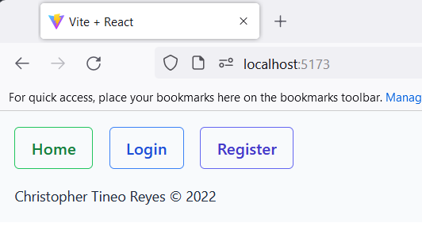

# Prueba técnica frontend MCTekk

Christopher Tineo Reyes

## Live demo

[Demo](https://jazzy-klepon-a45255.netlify.app/)

## Requirements

1. Have LTS version of [Node.js](https://nodejs.org/en/).
2. [Git](https://git-scm.com/downloads)

## How to install

1.Run the following commands

```
git clone https://github.com/TineoC/mctekk-test
cd mctekk-test
npm run dev
```

2. Open your favorite web browser in _localhost:5173_
3. Page should look like this
   
